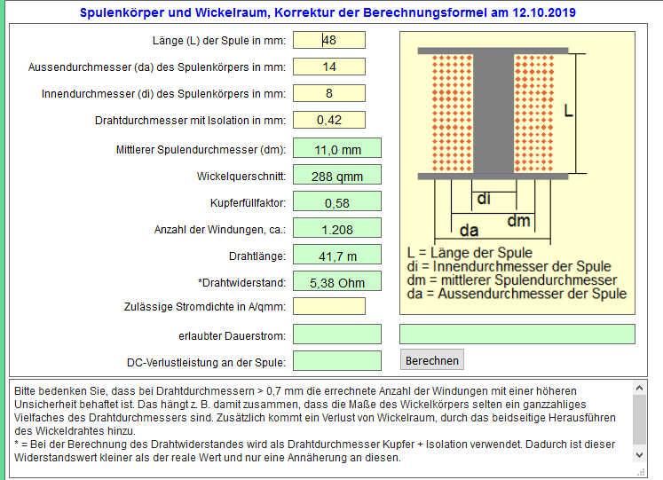

# Solenoid Motor

Dieses Repository beinhaltet die STL-Dateien so wie das DesignSpark Mechanical Projekt zum nachbauen des Solenoid Motor bekannt aus [ProjektionTV, die Sendung mit der Werkstatt.](https://twitch.tv/projektiontv).

Der Solenoid Motor besteht hauptsächlich aus 3D Druckteilen und Drehteilen. Der Sockel kann gedruckt werden oder auch gefräst.

## Stückliste pro Teil
+ Spulenhalter
    - Pleul Befestigung: Innensechskant Schraube M2 x 8mm + Mutter - 1 Stk
    - Spulenhalter Befestigung: Innensechskant Schraube M3 x 16mm - 4 Stk
+ Spule:
    - Kolben: 
        - Durchmesser: 6mm
        - Länge: 60mm
        - Material: ?
    - Spulenrohr:
        - Aussendurchmesser: 8mm
        - Innendurchmesser: 6mm
        - Länge: 60mm
        - Material: ?
    - Wicklung:
        - Draht: Kupferlackdraht 0,4mm - ca. 42m
        - Aufwickeln:
        
+ Schwungrad:
    - Gewichte: Innensechskant Schraube M6 x 10mm + Sicherungsmutter - 8 Stk
    - Befästigung auf Achse: Madenschraube M3 x 10mm - 3 Stk
+ Lagerbock:
    - Befestigung: Innensechskant Schraube M3 x 16mm - 4 Stück
    - Kugellager:
        - Lagerbock_606: 2 Stk 6mm x 17mm x 6mm
        - Lagerbock_mr106: 2 Stk 6mm x 10mm x 3mm
    - Achse:
        - Aussendurchmesser: 6mm
        - Länge: 61mm
        - Material: ?
+ Gnubbel:
    - Befästigung: Madenschraube M4 x 5mm - 1 Stk
+ Muffe:
    - Befästigung: Madenschraube M3 x 5mm - 1 Stk

## Stücklistegesamt
+ Innensechskant Schraube M2 x 8mm + Mutter - 1 Stk
+ Innensechskant Schraube M3 x 16mm - 8 Stk
+ Innensechskant Schraube M6 x 10mm + Sicherungsmutter - 8 Stk
+ Kupferlackdraht 0,4mm  - ca. 42m
+ Madenschraube M3 x 10mm - 3 Stk
+ Kugellager 2 Stk 6mm x 17mm x 6mm **oder** 2 Stk 6mm x 10mm x 3mm
+ Madenschraube M4 x 5mm - 1 Stk
+ Madenschraube M3 x 5mm - 1 Stk
+ TODO Achse
+ TODO Kolben
+ TODO Spulenrohr
